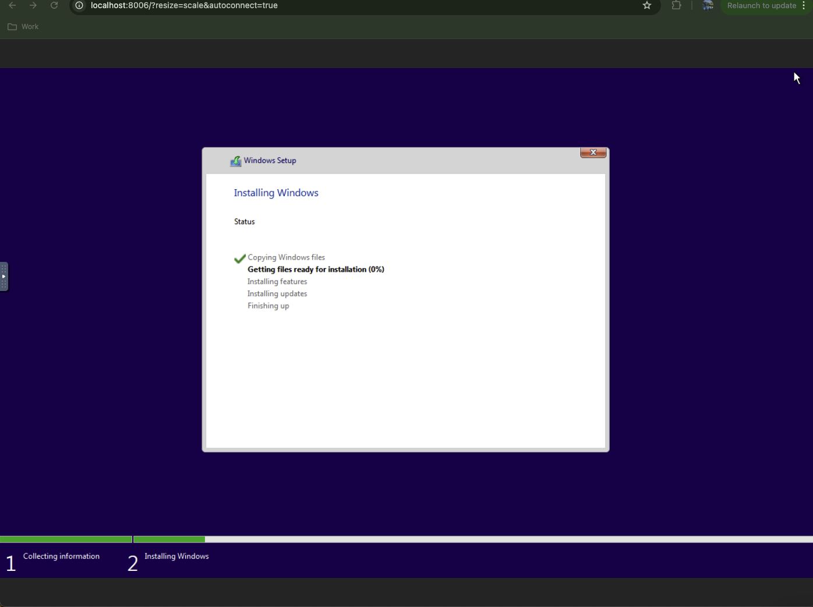

# Windows on docker

- https://hub.docker.com/r/dockurr/windows



```bash
docker-compose up

docker run -it --rm -p 8006:8006 --device=/dev/kvm --cap-add NET_ADMIN --stop-timeout 120 dockurr/windows
## need to remove the device if not using linux

```


## debugging

```bash
BdsDxe: failed to load Boot0002 "UEFI QEMU QEMU HARDDISK " from PciRoot(0x0)/Pci(0xA,0x0)/Scsi(0x0,0x0): Not Found
windows  | BdsDxe: loading Boot0001 "UEFI QEMU QEMU CD-ROM " from PciRoot(0x0)/Pci(0x5,0x0)/Scsi(0x0,0x0)
windows  | BdsDxe: starting Boot0001 "UEFI QEMU QEMU CD-ROM " from PciRoot(0x0)/Pci(0x5,0x0)/Scsi(0x0,0x0)

....

give it some time and it starts successfully...
```
